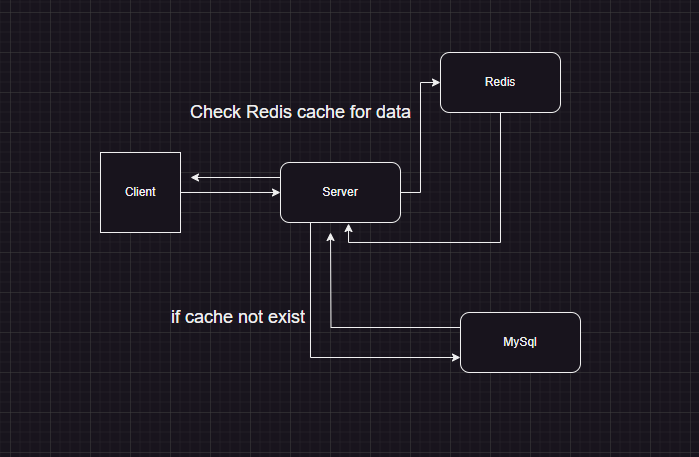

# TodoList app

## Description

This is a simple to-do list app that allows you to add, and delete tasks. Technologies

- React
- Flask
- Mysql


## How to run

### prerequisites

To run frontend:

$npm start

To run backend:

#flask run --host=0.0.0.0

```
Prepare will install all dependencies for both front-end and back-end and
start will run both servers and also docker containers for MySQL and Redis.

## Workflow diagram



## Api working

- [x] Create a new todo:
      In this API we will create a new todo and save it in the database then
      we will clear the Redis cache and update it with the new data from the database
- [x] Get all todos:
      In this API we will get all todos from the Redis cache if it's empty we will get it from the database and save it in the Redis cache
- [x] Delete a todo:
      In this API we will delete a todo from the database and then clear the Redis cache and update it with the new data from the database
